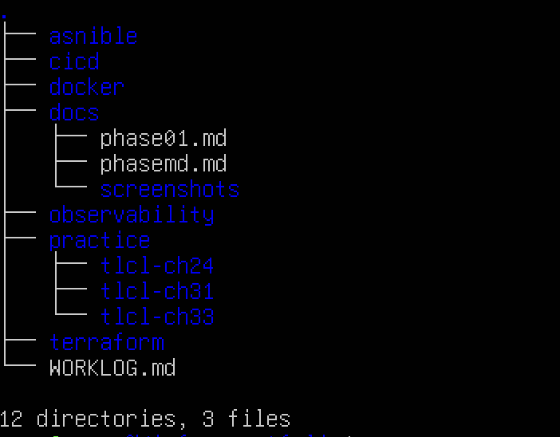
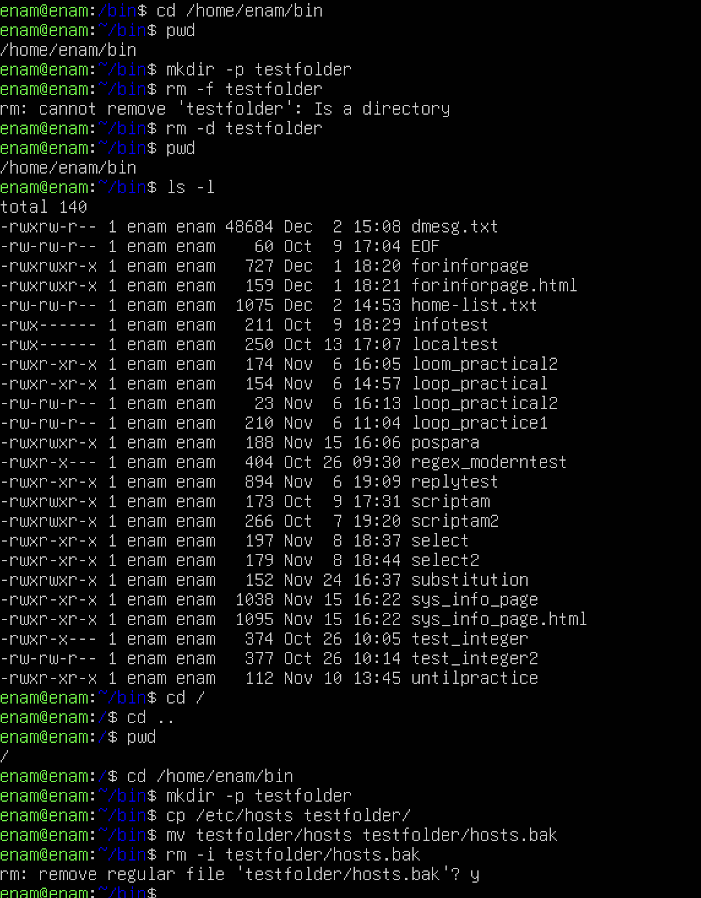
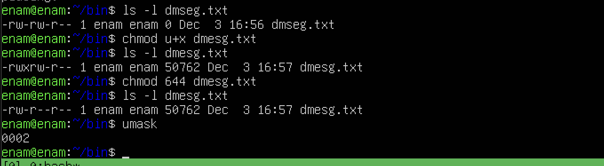
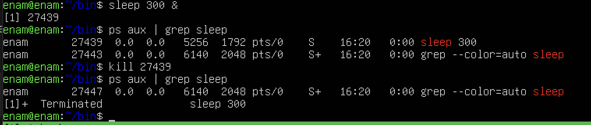
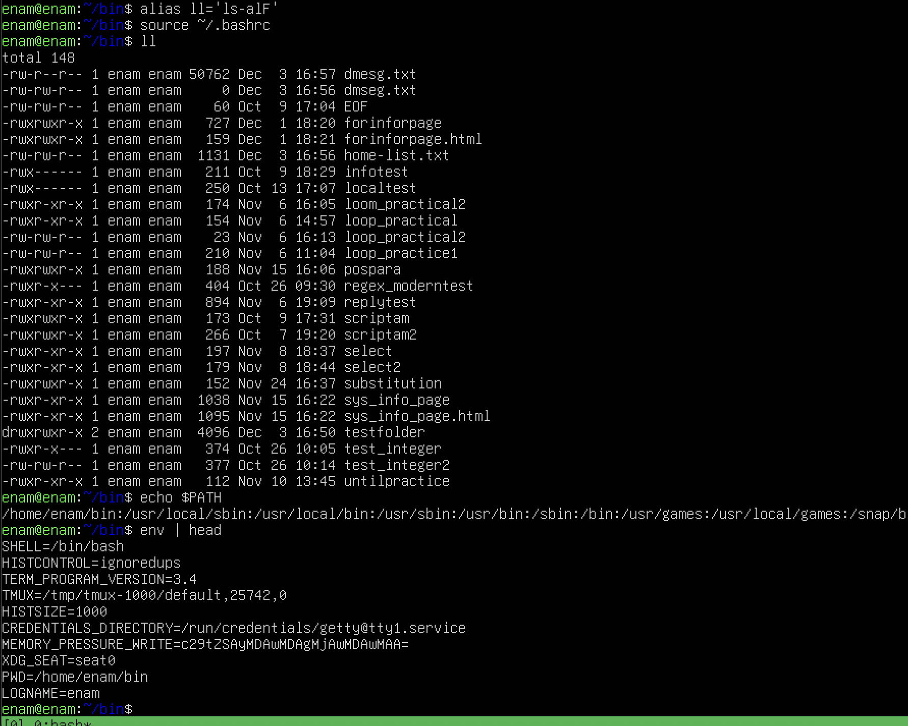

# Phase 1 — Linux & CLI Foundations

## 1. Problem Statement

I needed a solid foundation in Linux and the command line.
The goal of Phase 01 was to become comfortable navigating a Linux system, manipulating files safely,
understanding permissions and processes, and reading basic system documentation from the terminal.
This phase sets the baseline for all later work in the future.
The main risk was making mistakes on a live system, so all practice was done in a dedicated lab directory under my home folder.

## 2.context 

- Distro: Ubuntu on VM
- Shell: bash
- Editor: nano and  vim 
- Work as a normal user, escalate only with `sudo` when required.
- Practice location: `~/bin` and `~/infra-portfolio` to avoid touching system files.
- Reference material: The Linux Command Line (Ch. 1–7, 9–11) and man pages.

## 3. Setup Overview

A single linux host with a dedicated learning area in my home directory.

- '~/infra-portfolio/' - the repot that will store future infrastructure.
    - '/docs/' - case studies and screenshots 
    - '/practie/' - practie scripts
- ~/bin - The sandbox for file and dir expriments. ( permission, proccess etc)
- standard linux tools only: 'bash', 'ls', 'cp, 'mv', 'rm', 'chmod', 'ps', 'kill', 'man', etc.

## 4.Implementation 

### 4.1 Navigation & File managment 

The goal was to move confidently through the file system and manage files without relying on GUI.
Key commands and examples that i learned and  undrestood  absolute vs relatice path:
 
pwd
ls -l
cd /
cd ..
mkdir -p 
cp
mv
rm -i # to reduce the risk of deleting the wrong file.

### 4.2 Redirection, Pipes % Text tools 

The goal was to combine commands to inspect and filter data from the system.

Examples: 

ls -l /home/myuser > /home/myuser/bin/home-list.txt     # Redirected output to a file 
dmesg | tail -n 20 >> bin/dmesg.txt                     # Appended logs 

ps aux | grep ssh                                       # used pipeline for filtering 
cat /etc/passwd | cut -d: -f1 | sort | less             # used pipeline for filtering 

I Practiced >, >>, and pipelines | to build data flows.
Used less to view longer outputs safely.
Practiced text tools like cut, sort, uniq, and grep as building blocks.

### 4.3 Permissions & Users

The goal was to undrestand how permission affects linux files and services. 

Examples: 
ls example.txt                                          # read file modes and identifyin owener/groups/others
chmod u+X                                               # made the fils execuble by the user 
chmod 644                                               # set read/write permission for owner, readonly for others
umask                                                   # inspected defualt permissions

### 4.4 processes & the Environment 

The goal was to see what is running, control process and undrestand the environment variables. I did configured some custom alias in '~/.bashrc' as well.
 

Examples: 
ps aux                                                  # listed processes 
ps aux | grep bash                                      # listed processes and filterh 
sleep 300 & ps aux | grep sleep
kill <sleep pid>                             # I started a sleep process,sent it to bg, filtered it out to see the pid, then terminated it 

echo "$PATH"                                            # inspected path variable
env                                                     # inspected env variables 

## 5. verification 

To verify Phase 01 outcomes, I used the following checks:

- Navigation: Start in any directory and reach `~/infra-portfolio/docs/` using only `cd`, `pwd`, and `ls`.
- File operations: Create, move, and delete test files` without errors or accidental data loss.
- Pipelines: Build a one-liner to list all users on the system, sorted alphabetically.

## 6. What Could Break & How to Fix It

- Accidental deletions with `rm`: 
  - Risk: Running `rm` in the wrong directory or with wildcards.  
  - Mitigation: Practice only in sandbox`, use `rm -i`, and double-check `pwd` before destructive commands.

- Running commands as `root` / `sudo`:  
  - Risk: Misconfiguring system files or breaking packages.  
  - Mitigation: Stay as an unprivileged user; use `sudo` only when necessary and copy system files into sandbox and  edit it there.

- Overwriting files with redirection: 
  - Risk: `>` truncates files silently.  
  - Mitigation: Use `>>` when appending and redirect into temporary files first when unsure.

- Killing the wrong process:  
  - Risk: Stopping critical services or own terminal session.  
  - Mitigation: Use `ps aux | grep <name>` to confirm before `kill`.

## 7. Lessons Learned

- I became comfortable navigating the filesystem and working directly from the terminal.
- I learned how to combine simple commands with pipes to inspect, filter, and redirect output.
- I can read, interpret, and modify basic file permissions, and I understand how processes start, run, and stop.
- Practicing inside the sandbox` and `~/infra-portfolio` helped me avoid mistakes and build safe habits.

## 8. Screenshots

1. Repository structure  
   

2. Navigation & file operations  
   

3. Pipelines & redirection  
   

4. Permissions
   

5. Processes  
   

6. Environment & alias  
   

## Next Steps

I plan to start using Git to track my work and create simple shell scripts to automate repetitive tasks.

